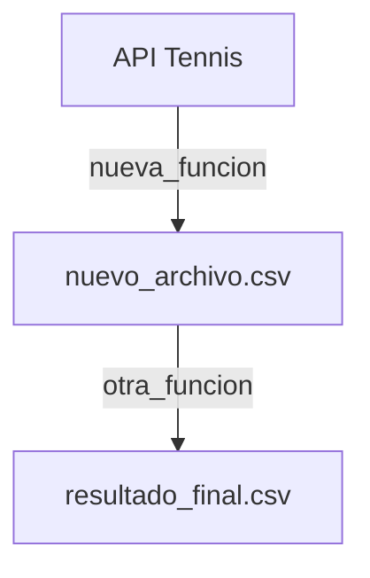

# Workflow: Actualizar Documentación de Funciones en TECHNICAL_DOCUMENTATION.md

Este workflow se ejecuta cuando se edita, añade o elimina una función en el proyecto. El objetivo es mantener el archivo `TECHNICAL_DOCUMENTATION.md` (privado, no se sube a GitHub) actualizado con información precisa y verificada.

> **Nota**: El archivo `TECHNICAL_DOCUMENTATION.md` es público y básico. La documentación técnica detallada está en `TECHNICAL_DOCUMENTATION.md` que está en `.gitignore`.

## Cuándo usar este workflow

- **Nueva función añadida**: Cuando creas una nueva función en cualquier archivo del proyecto
- **Función modificada**: Cuando cambias la firma, parámetros o comportamiento de una función existente
- **Función eliminada**: Cuando eliminas una función del proyecto
- **Archivos relacionados cambian**: Cuando una función ahora involucra archivos adicionales

## Pasos del Workflow

### 1. Identificar el cambio

Primero, identifica exactamente qué cambió:
- ¿Qué función fue añadida/modificada/eliminada?
- ¿En qué archivo está la función? (`scripts/tenis_api.py`, `scripts/process_files.py`, `streamlit_app.py`, etc.)
- ¿Qué archivos están relacionados con esta función?
- ¿La función llama a otras funciones? ¿Otras funciones la llaman?

```bash
# Ver funciones en un archivo específico
grep -n "^def " <archivo.py>

# Buscar referencias a una función en todo el proyecto
grep -r "nombre_funcion" --include="*.py" .
```

### 2. Verificar el código actual

Lee el código de la función para entender exactamente qué hace:

```bash
# Ver contenido de la función
cat <archivo.py>
```

Toma nota de:
- **Firma completa**: `def nombre_funcion(param1, param2, ...)`
- **Parámetros**: Nombre, tipo, valores por defecto
- **Retorno**: Qué tipo de dato retorna (DataFrame, dict, None, etc.)
- **Proceso**: Pasos principales que ejecuta
- **Archivos generados**: Qué CSVs/JSONs crea
- **Archivos leídos**: Qué archivos necesita para funcionar
- **Funciones llamadas**: Qué otras funciones invoca
- **Manejo de errores**: Cómo maneja errores (retorna None, lanza excepción, etc.)

### 3. Localizar la sección en TECHNICAL_DOCUMENTATION.md

Abre el TECHNICAL_DOCUMENTATION.md y localiza la sección correspondiente:

- **Funciones de API**: Sección `1️⃣ Funciones de API (scripts/tenis_api.py)`
- **Funciones de Procesamiento**: Sección `2️⃣ Funciones de Procesamiento de Datos (scripts/process_files.py)`
- **Funciones de Streamlit**: Sección `3️⃣ Funciones de Aplicación Web (streamlit_app.py)`
- **Funciones de Actualización**: Sección `4️⃣ Funciones de Actualización Automática`
- **Funciones de Utilidades**: Sección `5️⃣ Funciones de Configuración y Utilidades`
- **Scripts de Debug**: Sección `6️⃣ Scripts de Debugging`

### 4. Actualizar documentación según el tipo de cambio

#### Si es una NUEVA FUNCIÓN:

Añade la documentación siguiendo este formato exacto:

```markdown
#### `nombre_funcion(param1, param2, param3, ...)`
- **Descripción**: Breve descripción de qué hace la función (1-2 líneas)
- **Parámetros**:
  - `param1`: Descripción y tipo (default: valor si aplica)
  - `param2`: Descripción y tipo (default: valor si aplica)
- **Retorna**: Tipo de dato que retorna y descripción
- **Proceso**: (si es complejo, listar pasos numerados)
  1. Paso 1
  2. Paso 2
  3. ...
- **Archivos generados**: Lista de archivos CSV/JSON que crea
- **Archivos leídos**: Lista de archivos que necesita leer
- **Manejo de errores**: Cómo maneja errores (si es relevante)
- **Archivos involucrados**: 
  - `archivo1.py` (donde está definida)
  - `archivo2.py` (que la utiliza)
- **Nota**: Cualquier información adicional importante
```

**Ejemplo completo:**

```markdown
#### `get_player_stats(player_key, include_history, save_csv)`
- **Descripción**: Obtiene estadísticas completas de un jugador incluyendo ranking actual y rendimiento histórico
- **Parámetros**:
  - `player_key`: ID único del jugador (int)
  - `include_history`: Si incluir histórico de partidos (default: True)
  - `save_csv`: Si guardar resultados en CSV (default: True)
- **Retorna**: Dict con claves "stats", "ranking", "history" o None si hay error HTTP
- **Proceso**:
  1. Llama a la API endpoint `get_player`
  2. Procesa respuesta JSON
  3. Si include_history=True, llama a `get_fixtures(player_key)`
  4. Combina datos y guarda en CSV
- **Archivos generados**: 
  - `data/players/player_{player_key}_stats.csv`
  - `data/players/player_{player_key}_history.csv` (si include_history=True)
- **Manejo de errores**: Retorna None si status_code != 200
- **Archivos involucrados**: 
  - `scripts/tenis_api.py` (definición)
  - `streamlit_app.py` (la utiliza para mostrar perfil de jugador)
- **Nota**: Esta función consume 2 créditos de API si include_history=True
```

#### Si es una FUNCIÓN MODIFICADA:

1. Localiza la documentación existente de la función en TECHNICAL_DOCUMENTATION.md
2. Actualiza SOLO las partes que cambiaron:
   - Si cambió la firma: actualiza la línea `#### nombre_funcion(...)`
   - Si cambió un parámetro: actualiza la descripción del parámetro
   - Si cambió el retorno: actualiza la línea **Retorna**
   - Si cambió el proceso: actualiza la sección **Proceso**
   - Si cambió archivos generados/leídos: actualiza esas secciones
3. Añade una nota al final indicando la fecha de última actualización:
   ```markdown
   - **Última actualización**: 2026-02-06 - Añadido parámetro `include_tournaments`
   ```

#### Si es una FUNCIÓN ELIMINADA:

1. Localiza la documentación de la función en TECHNICAL_DOCUMENTATION.md
2. **Elimina completamente** la sección de esa función (desde `####` hasta antes del siguiente `####`)
3. Verifica si la función aparece mencionada en otras secciones (diagramas, tablas resumen, flujos de trabajo)
4. Actualiza o elimina esas referencias

### 5. Actualizar secciones relacionadas

Después de modificar la documentación de la función específica, verifica y actualiza si es necesario:

#### Tabla de Resumen de Archivos (Sección `📁 Resumen de Archivos por Función`)

Si añadiste/eliminaste funciones principales, actualiza la tabla:

```markdown
| Archivo | Funciones Principales | Propósito | LOC Aprox |
|---------|----------------------|-----------|-----------|
| `scripts/tenis_api.py` | `get_fixtures_for_a_date()`, `get_h2h()`, ... | Interacción con API | ~770 |
```

#### Diagrama de Flujo (Sección `📊 Flujo de Datos del Proyecto`)

Si la función participa en el flujo principal de datos, actualiza el diagrama Mermaid:



#### Métricas Clave (Sección `🎯 Métricas Clave Calculadas`)

Si la función afecta el cálculo de H2H, Recent Performance, Surface Performance o ATP Points, actualiza la descripción de la métrica correspondiente.

#### Flujos de Trabajo Típicos (Sección `🔄 Flujo de Trabajo Típico`)

Si la función cambia cómo funciona la aplicación desde el punto de vista del usuario, actualiza el flujo:

```markdown
1. **Usuario ingresa fecha** en la interfaz
2. **Se ejecuta**: `nueva_funcion()` 
   - Descripción de qué hace
3. **Se muestra**: Resultado
```

### 6. Verificar precisión

**CRÍTICO**: Antes de guardar, verifica que la documentación es 100% precisa:

```bash
# Abre el archivo de la función
cat scripts/archivo.py

# Compara lo que documentaste con el código real
# Verifica línea por línea:
# - ¿La firma es exacta?
# - ¿Los parámetros son correctos?
# - ¿El tipo de retorno es correcto?
# - ¿Los archivos generados son correctos?
```

**Errores comunes a evitar:**
- ❌ Decir que retorna DataFrame cuando retorna dict
- ❌ Decir que retorna dict cuando retorna None
- ❌ Decir que filtra por Singles cuando NO lo hace
- ❌ Decir que limita a 20 partidos cuando cuenta TODOS
- ❌ Olvidar mencionar funciones que se llaman automáticamente
- ❌ Olvidar mencionar normalización de datos (ej: superficies)

### 7. Actualizar la fecha de verificación

Al final del README.md, actualiza la fecha:

```markdown
**Documento verificado el 2026-02-06**  
**Versión:** 1.1 (Actualizado: añadida función get_player_stats)
```

### 8. Guardar y validar

Guarda el archivo README.md y valida que:
- ✅ El formato markdown es correcto (sin headers rotos, listas mal formateadas)
- ✅ Los links a archivos funcionan
- ✅ Los diagramas Mermaid se renderizan
- ✅ Las tablas están alineadas

```bash
# Validar markdown (opcional, si tienes markdownlint)
markdownlint README.md
```

## Checklist Final

Antes de completar el workflow, verifica:

- [ ] Identifiqué exactamente qué función cambió
- [ ] Leí el código actual de la función
- [ ] Verifiqué parámetros, retorno y proceso contra código real
- [ ] Actualicé la sección de la función en README
- [ ] Actualicé tabla de resumen si es necesario
- [ ] Actualicé diagrama de flujo si es necesario
- [ ] Actualicé métricas clave si es necesario
- [ ] Actualicé flujos de trabajo si es necesario
- [ ] Verifiqué que la documentación es 100% precisa
- [ ] Actualicé fecha de verificación
- [ ] Guardé README.md

## Notas Importantes

- **Precisión es crítica**: El README es la fuente de verdad. Documentación incorrecta confunde a desarrolladores futuros
- **Sé específico**: Mejor ser demasiado detallado que demasiado vago
- **Verifica contra código**: Siempre lee el código antes de documentar
- **Mantén formato consistente**: Usa el mismo formato que funciones existentes
- **Actualiza referencias**: Si una función cambia, puede afectar múltiples secciones del README
